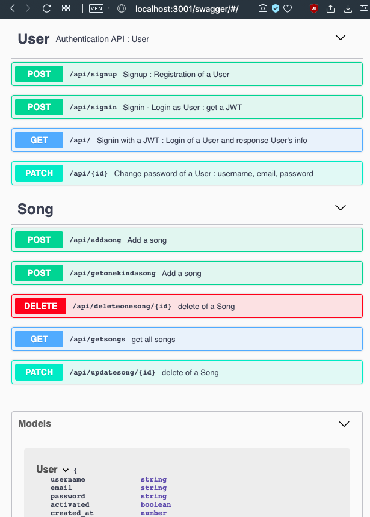
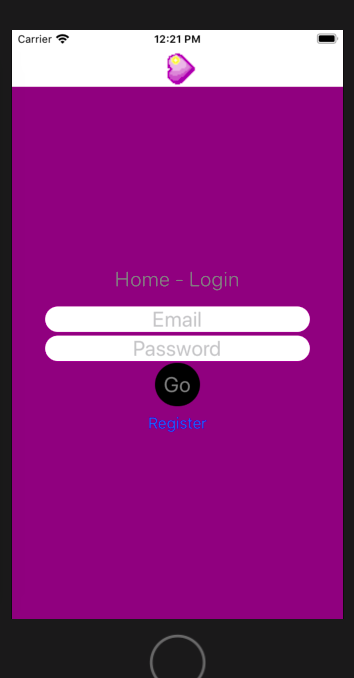

# NODE TYPESCRIPT authentication JWT #

Backend : node js, express, typescript, swagger, jwt
* authentication : user, token jwt
* add, update, delete, get file song
* mongo db, react native typescript for example



## React Native Typescripte




here is the react native application in another project repositorey

[exemple tuto](https://www.youtube.com/watch?v=qVUr4YC6ZXA)
[swagger tuto](https://www.youtube.com/watch?v=qemG0CWOx1I)

### What is this repository for? ###

Backend : node js, express, typescript, swagger, jwt, mongo db


* Structure

```
BACKEND
├── package.json
├── src
│   ├── app.ts
│   ├── controllers
│   │   ├── auth.controller.ts
│   │   └── song.controller.ts
│   ├── database.ts
│   ├── index.ts
│   ├── libs
│   │   └── verifyToken.ts
│   ├── models
│   │   ├── Playlist.ts // todo
│   │   ├── Song.ts
│   │   └── User.ts
│   ├── routes
│   │   └── auth.ts
│   ├── swagger.json
│   └── types.d.ts
└── tsconfig.json
```


### How to use ###

techno
* mac os x
* node js
* npm
* postman(for testing)


1.1. Create a .env from env.example

```
cp env.example .env
vim .env
```


cmd:
```
 npm install
 npm run dev
```

> localhost:3001

Docs on :

> localhost:3001/swagger

## INITLIAZATION

* Database configuration
* Dependencies

[docs initialization](./docs/INITIALIZATION.md)

## Doc API : swagger


```
npm i swagger-jsdoc swagger-ui-express
npm i  @types/swagger-jsdoc @types/swagger-ui-express -D
```
in App.ts
```
import swaggerUi from "swagger-ui-express";
import * as swaggerDocument from "./swagger.json";// https://stackoverflow.com/questions/49996456/importing-json-file-in-typescript

// Swagger Documentation API
app.use('/swagger', swaggerUi.serve, swaggerUi.setup(swaggerDocument));// go to /routes/auth.ts
```

Fix tsconfig.json < ! >

http://editor.swagger.io/

create a swagger.js and modify it [swagger doc](https://swagger.io/docs/specification/describing-parameters/#header-parameters)
```{
  "swagger": "2.0",
  "info": {
    "description": "This is a sample server Petstore server.  You can find out more about     Swagger at [http://swagger.io](http://swagger.io) or on [irc.freenode.net, #swagger](http://swagger.io/irc/).      For this sample, you can use the api key `special-key` to test the authorization     filters.",
    "version": "1.0.0",
    "title": "OS",
    "contact": {
      "email": "os @ 42school",
      "license": {
        "name": "Apache 2.0",
        "url": "http://www.apache.org/licenses/LICENSE-2.0.html"
      }
    }
  }
}
```

```
npm run dev
```

* localhost:3001/swagger

# in progress

* Deployment instructions

### Contribution guidelines ###

* Writing tests
* How to run tests
* Code review
* Other guidelines
